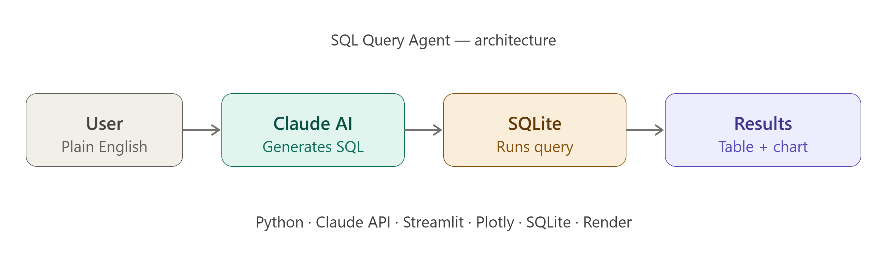

# SQL Query Agent

An AI-powered agent that converts plain English questions into SQL queries and returns results instantly.

## Architecture

## What it does
- Takes a plain English question as input
- Generates the correct SQL query using Claude AI
- Explains what the query does in simple terms
- Executes the query and displays results

## Tech Stack
- Python
- Anthropic Claude API
- Streamlit
- SQLite
- Pandas

## How to run
1. Clone the repo
2. Install dependencies: `pip install -r requirements.txt`
3. Add your Anthropic API key to a `.env` file
4. Run: `python -m streamlit run app.py`

## Use Case
Built as a demonstration of AI agents applied to fraud transaction analysis.
Useful for analysts who need quick data insights without writing SQL manually.